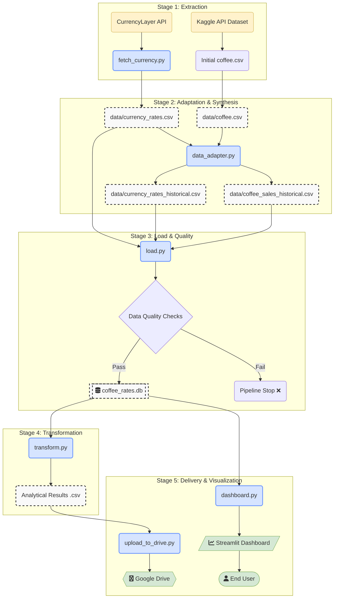

# Pipeline - From API to Streamlit

This repository features a complete, automated ETL pipeline built with Python, designed to be maintainable, testable, and simple.

The project extracts data from external sources, synthesizes a realistic historical dataset, performs data quality checks, loads it into a relational database, runs analytical transformations, and delivers the final results to both Google Drive and an interactive web dashboard.

---

## 🏛️ Project Architecture

The pipeline is orchestrated by `main.py` and follows a standard ETL workflow, broken down into logical, modular scripts.



## ⚙️ Pipeline Stages Explained
Each stage of the pipeline is handled by one or more dedicated scripts within the src/ directory.

1. Extraction
fetch_currency.py: Fetches the last 30 days of currency exchange rates (BRL, EUR, CLP, USD) from the CurrencyLayer API. This data is primarily used for the "latest rates" metrics on the dashboard.

2. Data Adaptation & Synthesis
data_adapter.py: This is a crucial step to overcome the limitations of free APIs for historical data.

- It establishes a dynamic 3-year date range.

- It uses original data from Kaggle and the API to learn a realistic statistical range (based on quartiles).

- It backfills any missing data points for currencies with realistic synthetic values.

- It transforms the aggregated daily coffee price data into a granular table of simulated sales transactions, creating a rich dataset for analysis.

3. Load & Data Quality
- load.py: This script is responsible for populating the database.

- It reads the historical CSV files generated by the adapter.

- It runs a series of Data Quality Checks (from quality.py) to validate the data, checking for nulls, correct value ranges, and consistency before loading.

- If the checks pass, it loads the data into an SQLite database (data/coffee_rates.db), replacing any old data to ensure idempotency.

4. Transformation
transform.py: Reads the analytical queries from the sql/ directory and executes them against the SQLite database. The queries perform aggregations to answer the key business questions from the challenge, such as finding the day with the highest sales volume and calculating annual/monthly averages. The results are saved to new CSV files.

5. Delivery & Visualization
upload_to_drive.py: Uploads the final analytical CSV files to a shared Google Drive folder, completing the data delivery process.

dashboard.py: Launches an interactive web application built with Streamlit, providing filters, metrics, and charts for end-user analysis.

## 🛠️ How to Run
Follow these steps to set up and run the project locally.

Prerequisites
Python 3.9+

Git

1. Clone the Repository
Bash
```
git clone [https://github.com/your-username/analytics-engineer-test.git](https://github.com/your-username/analytics-engineer-test.git)
cd analytics-engineer-test
```

2. Set Up Virtual Environment
It is highly recommended to use a virtual environment.

```
# Create the virtual environment
python -m venv .venv

# Activate it
# On Windows:
.venv\Scripts\activate
# On macOS/Linux:
source .venv/bin/activate
```
3. Install Dependencies
```
pip install -r requirements.txt
```

4. Configure Environment Variables
This project requires API keys for Kaggle and CurrencyLayer.

Create a copy of the example environment file:

```
# On Windows
copy .env.example .env
# On macOS/Linux
cp .env.example .env
```
Open the newly created .env file and add your personal credentials:

- `CURRENCYLAYER_API_KEY`: Your API key from currencylayer.com.

- `KAGGLE_USERNAME`: Your Kaggle username.

- `KAGGLE_KEY`: Your Kaggle API key (can be generated from your Kaggle account page).

5. Configure Google Drive API
To enable uploads to Google Drive, you need to configure OAuth credentials.

- Follow the [Google Cloud instructions](https://developers.google.com/workspace/guides/create-credentials?hl=pt-br)  to enable the Google Drive API and create OAuth 2.0 Client IDs for a Desktop app.

- Download the credentials JSON file.

- Rename the file to client_secrets.json and place it in the root directory of this project.

- Important: The .gitignore file is already configured to ignore client_secrets.json, so your credentials will not be committed to Git.

6. Run the Full Pipeline
With everything configured, you can run the entire ETL pipeline from extraction to upload with a single command:

```
python main.py
```
7. View the Dashboard
To launch the interactive dashboard, run the following command:
```
streamlit run dashboard.py
```
A new tab will open in your browser with the dashboard.
